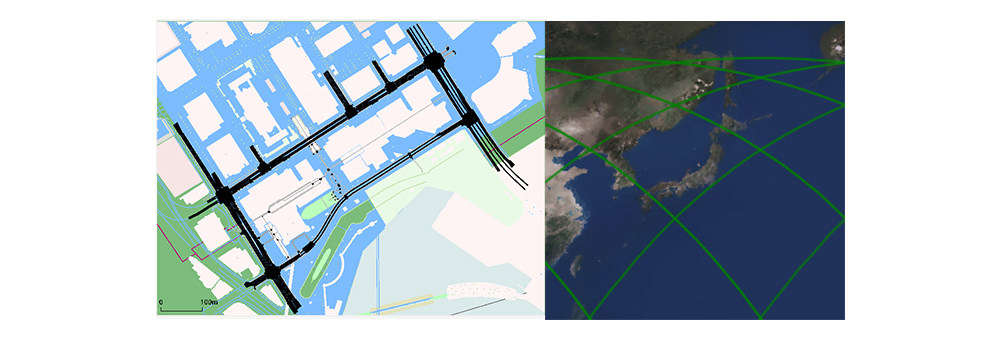
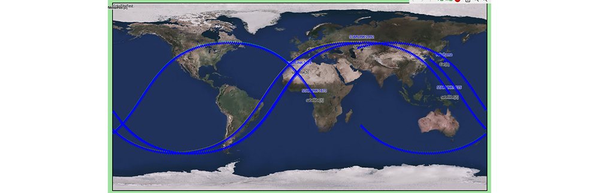

# LEO Satellite Communication Simulation Framework for Connected Vehicles

# 1. Overview

- This is a simulation framework designed for evaluating satellite communications on the OMNeT++ / OMNEST network simulator. This framework is built upon the following state-of-the-art OMNeT++ modules, maintained by the research community:
  - INET (https://github.com/inet-framework/inet)
  - OS3 (https://github.com/inet-framework/os3)
  - leosatellites (https://github.com/Avian688/leosatellites)          
  - Veins (https://github.com/sommer/veins)
  - Simu5G (https://github.com/Unipisa/Simu5G)
- INET is used as the basis of wireless communication models, and we extend them with additional propagation characteristics. The key extensions include free space path loss, propagation, and beam width models. The Apsk scalar radio medium model is utilized in this context. Various RadioMedium parameters, such as transmission power, antenna gain, noise levels, and SNR functions, are specifically initialized for satellite communication.
- The satellite mobility model is derived from the OS3 framework. Satellite orbit calculations reference the SGP4 orbit arithmetic model and/or use two-line element (TLE) information.
- We use Veins to interface OMNeT++ and the SUMO road traffic simulator. 
- Additionally, Simu5G is utilized for simulating 5G communication between ground base stations and user equipment (UE) models.

Detailed design of this simulator and selected results from our simulations can be found in the following research publication:
```
Jing Ma, Lei Zhong, and Ryokichi Onishi, "LEO Satellite Communication Simulation Framework for Connected Vehicles," in Proceedings of the 2023 IEEE Global Communications Conference (GLOBECOM), pp.6603-6608, 2023. 
```

---

# 2. Installation

- Clone this git repository along with its external submodules. 
  ```
  git clone --recursive https://github.com/ToyotaInfoTech/simu-scs.git
  ```
- Run the following script to install dependencies. 
  ```
  cd simu-scs
  ./prepare_dependencies.sh
  ```
- Launch OMNeT++ IDE and create a new OMNeT++ workspace. OMNeT++ IDE will ask you whether to install INET Framework and OMNeT++ programming examples. Uncheck both options and click "OK". 
- On the OMNeT++ IDE window, select File->import… and chose “Existing projects into workspace”.
- In the pop-up window, check the "select root directory" option, and click "Browse" button next to it. In the directory selection window, choose the `simu-scs/` directory that you have just cloned. 
- Check all the projects in the project list, then click "Finish" to create the project.
- Once the projects are imported, select "Project->Build all".

---

# 3. Architecture

- The following provides a high-level overview of the SimuSCS framework. 

  

## 3.1 SUMO cosimulation

- The left side of the aforementioned diagram illustrates the SUMO environment. When conducting a simulation involving vehicle mobility, the SUMO application must be initiated prior to the OMNeT++ simulation. It is important to set the "num client" option to 1, as the OMNeT++ simulation will be running as a single client.

  ```
  sumo-gui --remote-port 9999 --num-clients 1 -c config.sumocfg
  ```

- In simulations that involve both SUMO and OMNeT++, the Veins module links the vehicle mobility simulated by SUMO to the OMNeT++ simulation. The Veins module, utilizing the TraCI interface, tracks vehicle movements, relays location data to the OMNeT++ canvas, and displays these movements within the OMNeT++ environment. When incorporating the Simu5G module, simulations of vehicle mobility paired with 5G wireless communication can be executed.
- Moreover, it is possible to run a SUMO traffic simulation scenario wherein the OMNeT++ canvas simultaneously displays the SUMO map. For setting up your traffic simulation scenario in SUMO, you should configure it using files like *.sumocfg, .rou.xml, and construct the road situation with .net and .poly.xml files.

## 3.2 Veins vehicle

- Veins uses the TraCI interface to connect the vehicle locations from SUMO (expressed in longitude and latitude coordinates) to vehicle mobility in OMNeT++. These global coordinates are essential for calculating the distance between the satellite and the vehicle. SCS facilitates wireless communication links from the ground station to the satellite, and from the satellite to the user device. Veins, in conjunction with Simu5G, then establishes a link between the user device and the UE terminal.
- On the OMNeT++ canvas, the SUMO map and satellite Earth  map are displayed side by side, with visualized communication links drawn by the OMNeT++ module.

  

- In the *.ini file for the simulation, specify the Veins manager and typename as shown below.

  ```
  *.manager.moduleType = "org.scs.veins_inet.InetCar"
  *.node[*].mobility.typename = "VeinsInetMobility"
  ```

## 3.3 Satellite coordinate system

- The global map used by the SimuSCS utilizes the WGS-72 World Geodetic System coordinates. In the figure below,  the semimajor axis (a) is 6,378.135 km, and the semiminor axis (b) is 6,356.752 km.
- The Earth-Centered Inertial coordinate system（cECI) has the Earth’s center as its origin. The Z-axis points toward the North Pole. The X-axis is aligned with the direction of the Sun at the vernal equinox, intersecting the ecliptic and equator. The Y-axis, following the right-hand rule, is orthogonally aligned. This coordinate system remains fixed and does not change with the Earth’s rotation.<br>Satellite orbit calculations use this cECI coordinate system.

  

## 3.4 Satellite system mobility

- Orbit calculation
  - The OS3 library provides the North American Aerospace Defense (NORAD) Simplified General Perturbation 4 (SGP4) model. This model uses Kepler’s laws and orbit information (such as the number of orbits, date, and time) to calculate satellite orbits. An example setup in the .ini file is shown below.

    ```
    *.satellite[*].NoradModule.TLEfile = "starlink2023.txt"
    *.satellite[*].mobility.targetyear = 123
    *.satellite[*].mobility.targetmonth = 2
    *.satellite[*].mobility.targetday = 2
    *.satellite[*].mobility.targethour = 12
    *.satellite[*].mobility.targetsec = 10
    *.satellite[*].mobility.targetwday = 4
    *.satellite[*].mobility.targetyday = 60
    *.satellite[*].mobility.enableRepeatCycle = 1
    *.satellite[*].satelliteName = "STARLINK-3308"
    *.satellite[*].mobility.cycleTime = 360
    .satellite[*].mobility.targetmin = 8
    ```

  - "targetyear,"  "targetmonth," "targetday," "targethour," "targetmin," "targetsec," "targetwday," "targetyday" are target epoch time. Set "enableRepeatCycle" as 0 for not repeat, 1 for repeat after cycle is over. "cycleTime" is repeat cycle time.
- Satellite TLE
  - TLE is a two-line format that represents the orbital information of space objects, monitored and published by NORAD. By entering this data into a text file and setting the file name in the .ini file as the parameter "TLEfile," the SCS calculates the satellite’s orbit based on the specified TLE set.
- As it calculates the orbit position, SCS maps the satellite’s mobility on the OMNeT++ canvas. An example of an orbit trajectory, indicated in green, is shown in the picture below. The size of the canvas can be adjusted by scaling the map size in the .ini file.

  

- To set up the OMNeT++ canvas with the SUMO map, follow the instructions below.

  

  ```
  *.Pos.offsetX = 1080
  *.Pos.offset_x = 1770
  *.Pos.offset_y = 181
  *.Pos.mapx = 2160
  *.Pos.mapy = 1080
  *.Pos.mapx2 = 255
  *.Pos.mapy2 = 255
  *.Pos.emapx = 1080
  *.Pos.emapy = 1080
  ```

## 3.5 Multiple beam

- The satellite beam positions are mapped as illustrated. Corresponding to satellite mobility, the ground station’s position is associated with the beam’s position. Radio channels, including the frequency reuse factor, are assigned for each beam coordinate position. These settings are configured in the .ini file.

  

  <strong>.ini file</strong>

  ```
  *.satellite[*].numBeamInterfaces = 2           # numOfChannels + 1
  *.satellite[*].numSubChannels = 1
  *.satellite[*].bm.numBeamInterfaces = 2      # numOfChannels + 1
  *.satellite[*].bm.numSubChannels = 1
  *.satellite[*].numWlanInterfaces = 2
  ```

## 3.6 RF Link

- Satellite communication path loss
  - The signal attenuation between the satellite and ground terminal is calculated based on 3GPP TR38.811, Chapter 6.6.2. The path loss is composed of several components as shown below.

    $$PL=PL_b+PL_g+PL_s+PL_e$$

    The basic path loss accounts for free space propagation, clutter loss, and shadow fading. For more details, refer to TR38.811. The free space loss formula is:

    $$FSPL(d,f_c)=32.45+20log_{10}?(f_c)+20log_{10}?(d)$$

    where the distance $d$ between the satellite and terminal is measured in meters, and the radio frequency $f_c$ is in GHz.<br>
    The parameters for shadow fading, clutter loss, scintillation, atmospheric, and building loss are provided in an XML configuration file named plConfig.xml. This file should be located in the same folder as the running simulation. Specify the file name in the .ini file, as shown in the example below.

    ```
    **.<radiomedium>.pathLoss.typename = "SatellitePathloss"
    **.<radiomedium>. pathLoss.plConfig = xmldoc("plConfig.xml")
    ```

- Satellite communication propagation
  - The signal propagation time between the satellite and ground terminal depends on the distance. The satellite’s position is calculated using the OS3 library from orbit calculations. The satellite’s height, as given by the simulation parameter, is used to determine the distance. This distance is then divided by the speed of light 'c" to calculate the propagation delay. For instance, the propagation time  for a LEO satellite at approximately 500 km height is approximately 40 ms.


## 3.7 Satellite multiple access

- SCS simulates FDMA. In the .ini file, radio mediums are assigned to each channel, with each medium connecting to a dedicated ground station module. The setup in the .ini file is demonstrated below.

  ```
  *.GroundStation[0].wlan[*].radio.radioMediumModule = "radioMedium[0]"
  *.GroundStation[1].wlan[*].radio.radioMediumModule = "radioMedium[1]"
  *.GroundStation[2].wlan[*].radio.radioMediumModule = "radioMedium[2]"
  *.GroundStation[3].wlan[*].radio.radioMediumModule = "radioMedium[3]"
  *.GroundStation[4].wlan[*].radio.radioMediumModule = "radioMedium[4]"
  *.GroundStation[5].wlan[*].radio.radioMediumModule = "radioMedium[5]"
  *.Satellite[0].cnl[*].radio.radioMediumModule = "radioMedium[0]"
  *.Satellite[1].cnl[*].radio.radioMediumModule = "radioMedium[1]"
  *.Satellite[2].cnl[*].radio.radioMediumModule = "radioMedium[2]"
  *.Satellite[3].cnl[*].radio.radioMediumModule = "radioMedium[3]"
  *.Satellite[4].cnl[*].radio.radioMediumModule = "radioMedium[4]"
  *.Satellite[5].cnl[*].radio.radioMediumModule = "radioMedium[5]"
  ```

## 3.8 Satellite sim5G cosimulation

- Utilizing the sim5G Project, the simulation can establish a 5G network for ground-level communication paths. Below is an example of 5G communication between UE and a server, incorporating a satellite communication path.

  

---

# 4 Sample simulation

SCS platform offers simple sample programs.

## Satellite orbit mobility

- Abstract: Simulate orbit mobility of 1 to 4 satellites using SGP4 and TLE.
- Folder: SatelliteOrbit.
  - [STARLINK-2Sat]  User TLE to simulate to track 2 LEO satellite orbit.
  - [STARLINK-4Sat]  User TLE to simulate to track 4 LEO satellite orbit.
  - [SampleConfig4sat] User TLE to simulate to track 4 series of LEO satellite orbit near Japan.
  - [NoradPlaneTest] 24 Planes, show top 20 Satellites from TLE file list. show 12 MMC locations.
- Output sample:
  - [STARLINK-4Sat]

    

## 4.2 Simple satellite communication test

- Abstract: Test UDP transmission for uplink/downlink throughput from ground station to satellite and vice versa.
- Folder: SatelliteEvaluation.
  - [MCC2SAT] Feeder link forward, send UDP continuous transfer in 75us cycle, from MissionControlCenter(MCC) to Satellite(SAT).
  - [SAT2MCC] Feeder link return , send UDP continuous transfer in 75us , 
    from SAT to MCC.
  - [GS2SAT] Service link return, send UDP continuous transfer in 80us,
    from GroudStation(GS) to SAT.
  - [SAT2GS] Service link forward, send UDP continuous transfer in 80us,
    from SAT to GS.
  - [UDPBurstMCC2GS8] Feeder link full path. Send 8 burst UDP transfer in 
    120us, from MCC, via SAT to GS.
  - [UDPPacket6] Feeder link to 6 ground stations, send UDP continuous 
    transfer in 1ms cycle, from 1 MCC, via SAT to 6 GSs.
  - [UDPPacket8] Feeder link to 8 ground stations, send UDP continuous 
    transfer in 1ms cycle, from 1 MCC, via SAT to 6 GSs.
  - [UDPAppGS2MCC] Service , send UDP continuous transfer in 120us,
    from 2 GSs, via SAT to 1 MCC.

  

- Output sample:
  - Condition. Transmitter, receiver bandwidth 500Mbps、app:UDPBasicApp. Send interval 75us
  - Result observed max 468Mbps. Feeder link from MCC to Sat, Sat to MCC.

## 4.3 Multiple 5G UE communication through put test

- Abstract: Integrates with Sim5G simulation to assess satellite communication paths within 5G communication. The number of UEs is variable-dependent. Test throughput between UE and server, incorporating a satellite communication path.
- Folder: SCS5GFusion
  - [UDP5G]  VoIP UDP packet transfer from server to UE via satellite communication.
  - [PacketSize_4375] UDP packet transfer from server to UE via satellite communication, with vary number 
    of UE terminals, 2,5,10,20,50,100,200,500 to see through put.
- Output log sample:
  [PacketSize_4375] 

  

## 4.4 Veins_sim5g simulation

- Veins simu5g
  - Abstract: Based on VS5G simulation, assign UE to the vehicle mobility module and use Veins to control mobility. The OMNeT++ canvas displays the SUMO map on the left for vehicle movement and an Earth map on the right to track satellite movement.
  - Instruction
    - Before you run this test, install SUMO application from "https://eclipse.dev/sumo/"
    - On terminal, navigate to "sumodir" folder and run "sumoexe". SUMO application will start.
    - On OMNeT++ IDE, from SCSV5GFution folder, run omnetpp.ini
    - On the simulation panel, click run.
    - On the SUMO application, click run
  - Folder: SCSV5Gfusion.
    - [UDP5GNode0] VoIP UDP packet transfer from server to UE on vehicle via satellite communication.
  - Output sample:

    
